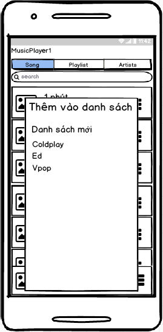

# mp-n1_19_musicapp
mp-n1_19_musicapp created by GitHub Classroom

BÁO CÁO BÀI TẬP LỚN 
 
MÔN PHÁT TRIỂN ỨNG DỤNG CHO CÁC THIẾT BỊ DI ĐỘNG 

Nhóm 1_19: 2 thành viên

- Họ và tên: Lê Mạnh Huy - B15DCAT093
- Họ và tên: Nguyễn Đình Vượng - B15DCAT198

NỘI DUNG
I. Thiết kế giao diện:
- 
- 
- 
- 
1. Giao diện chính (MainActivity):
- gồm 3 phần Tablayout, ViewPager, 1 Layout thông tin bài hát đang phát bao gồm tên bài hát, ca sĩ, ảnh album
- ViewPager dùng để điều khiển các fragment, được sử dụng kết hợp với Tablayout, điều khiển chuyển fragment khi vuốt hay chọn label
2. Các Fragment:
- gồm FragmentListsong và FragmentPlaylist danh sách
    - FragmentListsong gồm
        - ListView hiển thị tất cả các bài hát đọc được trong diện thoại 
        - EditText để tìm kiếm bài hát
    - FragmentPlaylist 
        - ListView hiển thị danh sách phát nhạc (do người dùng tạo)
        - 2 ImageView thể hiện 2 danh sách phát mặc định
        - 1 Button để tạo mới danh sách phát
3. Các Activity khác:
- ActivityPlay
    - giao diện phát nhạc, được gọi khi người dùng chọn bài hát từ fragment 
    - gồm các ImageView, TextView, ImageButton để hiển thị cũng như phục vụ quá trình chơi nhạc
- QueueActivity:
    - ListView hiển thị các bài hát trong danh sách đang phát (danh sách đợi)
- ActivitySongOfPL:
    - giao diện hiển thị các bài hát trong Playlist
    - được gọi khi người dùng chọn một Playlist trong FragmentPlaylist
    
II. Mô tả ứng dụng:
- đọc tất cả định dạng nhạc trong máy
- tạo danh sách phát nhạc để tùy chọn phát những bài mình muốn
- lưu trữ bài hát (tên bài hát, ca sĩ, đường dẫn ..) để những lần chạy sau không mất thời gian load lại từ đầu
- các tác vụ cơ bản khi chơi nhạc
- tùy chọn hiển thị sóng nhạc khi chơi nhạc (đồng bộ với bài hát)
- tùy chọn hiển thị lời bài hát thời gian thực
- notification hỗ trợ điều khiển chơi nhạc, tùy biến khi bài hát thay đổi (theo ảnh cover của bài hát) 

III. Phân công công việc nhóm:
- Lê Mạnh Huy:
    - thiết kế giao diện
    - Service
    - xây dựng mô hình chơi nhạc
    - chức năng lời bài hát
    - chức năng sóng
- Nguyễn Đình Vượng
    - Thiết kế giao diện
    - Support tìm hiểu các yêu cầu của thầy
    - Đọc ghi dữ liệu
    - xây dựng chức năng playlist
